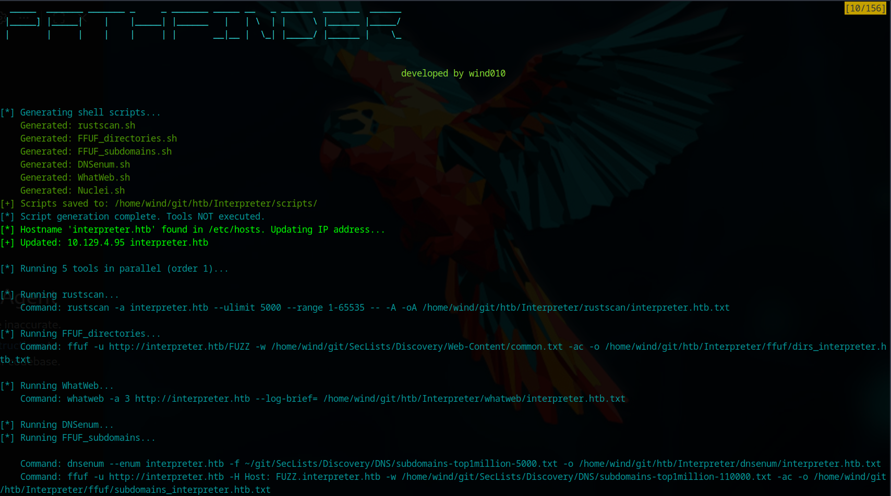

# Pathfinder - Automated Recon Tool



A flexible, configuration-based reconnaissance automation tool for penetration testing and CTF challenges. Pathfinder streamlines the initial enumeration phase by orchestrating multiple security tools in parallel or sequential execution based on your configuration.

LLM code assisted.

## Features

- **📋 Config-driven**: Define all your recon tools and their execution order in a single YAML file
- **⚡ Parallel execution**: Tools with the same order value run simultaneously for maximum efficiency
- **🔄 Sequential execution**: Different order values run one after another for dependency management
- **🌐 Automatic /etc/hosts management**: Automatically updates host entries before scanning (Windows & Linux)
- **🔧 Variable substitution**: Dynamic values in tool arguments (`{ip}`, `{hostname}`, `{output_dir}`, etc.)
- **📝 Script generation**: Automatically generates standalone shell scripts for each tool
- **🎨 Colorized output**: Clear, color-coded terminal output for easy monitoring
- **⏱️ Timeout handling**: Built-in timeout protection (1 hour per tool)
- **🐛 Debug mode**: Detailed logging for troubleshooting

## Installation

### Prerequisites
- Python 3.6+
- Administrator/sudo privileges (for /etc/hosts updates)
- Your preferred recon tools (e.g., rustscan, ffuf, nmap, gobuster, etc.)

### Method 1: Install with pipx (Recommended)

pipx installs Python applications in isolated environments:

```bash
# Install pathfinder from GitHub
pipx install git+https://github.com/wind010/Pathfinder.git

# Or install from a local clone
git clone https://github.com/wind010/Pathfinder.git
cd Pathfinder
pipx install .
```

After installation, the `pathfinder` command is available system-wide:
```bash
pathfinder --ip 10.10.10.10 --hostname example.htb -o ./scans/example -c ./config.yaml
```

**Note:** You'll need a `config.yaml` file. Copy the example from the repository or create your own.

### Method 2: Install with pip

```bash
# Clone the repository
git clone https://github.com/wind010/Pathfinder.git
cd Pathfinder

# Install the package
pip install .

# Or install in development mode (for contributors)
pip install -e .
```

**Dependencies:**
- `PyYAML>=6.0.3` - YAML configuration parsing
- `colorama>=0.4.6` - Cross-platform colored terminal output

### Getting Configuration File

After installation, you'll need a `config.yaml` file:

```bash
# Download example config from repository
curl -O https://raw.githubusercontent.com/wind010/Pathfinder/main/config.yaml

# Or copy from a local clone
git clone https://github.com/wind010/Pathfinder.git
cp Pathfinder/config.yaml ./
```

### Uninstalling

```bash
# If installed with pipx
pipx uninstall pathfinder-recon

# If installed with pip
pip uninstall pathfinder-recon
```

## Usage

### Basic Syntax

**Standard usage:**
```bash
sudo pathfinder --ip <target_ip> --hostname <target_hostname> -o <output_directory> -c <config_file> [OPTIONS]
```

Sudo is not needed when you skip the `/etc/hosts` file update:
```bash
pathfinder --ip <target_ip> --hostname <target_hostname> -o <output_directory> -c <config_file> --skip-hosts [OPTIONS]
```

### Required Arguments
- `--ip` - Target IP address
- `--hostname` - Target hostname (will be added to /etc/hosts)
- `-o, --output-dir` - Output directory for results

### Optional Arguments
- `-c, --config` - Path to configuration file (default: `./config.yaml`)
- `-s, --skip-hosts` - Skip updating /etc/hosts file 
- `-d, --debug` - Enable debug logging with detailed error information
- `-g, --generate-scripts-only` - Generate shell scripts without executing tools

### Examples

**Basic scan:**
```bash
pathfinder --ip 10.10.10.10 --hostname example.htb -o ./scans/example -c ./config.yaml
```

**Custom config file:**
```bash
pathfinder --ip 10.10.10.10 --hostname example.htb -o ./scans/example -c ~/my-configs/custom.yaml
python pathfinder.py --ip 10.10.10.10 --hostname example.htb -o ./scans/example -c custom_config.yaml
```

**Generate scripts only (no execution):**
```bash
pathfinder --ip 10.10.10.10 --hostname example.htb -o ./scans/example -c ./config.yaml -g
```

**Skip /etc/hosts update:**
```bash
pathfinder --ip 10.10.10.10 --hostname example.htb -o ./scans/example -c ./config.yaml --skip-hosts
```

**Enable debug mode:**
```bash
pathfinder --ip 10.10.10.10 --hostname example.htb -o ./scans/example -c ./config.yaml -d
```

### Running with Elevated Privileges

For /etc/hosts updates, Pathfinder needs elevated privileges. Here are the recommended approaches:

#### Option 1: Let Pathfinder Handle sudo (Recommended)

Run pathfinder **without** sudo. The tool will automatically request sudo when needed for /etc/hosts updates:

```bash
pathfinder --ip 10.10.10.10 --hostname example.htb -o ./scans/example -c ./config.yaml
```

When prompted, enter your password for the sudo request.

#### Option 2: Skip /etc/hosts Updates

If you don't need automatic hosts file management, skip it:

```bash
pathfinder --ip 10.10.10.10 --hostname example.htb -o ./scans/example -c ./config.yaml --skip-hosts
```

Then manually add the entry to `/etc/hosts`:
```bash
echo "10.10.10.10 example.htb" | sudo tee -a /etc/hosts
```

#### Option 3: Run with sudo (pipx installations)

If installed with **pipx**, `sudo pathfinder` won't work because pipx installs to your user directory. Use one of these workarounds:

**Preserve PATH:**
```bash
sudo env "PATH=$PATH" pathfinder --ip 10.10.10.10 --hostname example.htb -o ./scans/example -c ./config.yaml
```

**Use full path:**
```bash
sudo ~/.local/bin/pathfinder --ip 10.10.10.10 --hostname example.htb -o ./scans/example -c ./config.yaml
```

**Preserve environment:**
```bash
sudo -E pathfinder --ip 10.10.10.10 --hostname example.htb -o ./scans/example -c ./config.yaml
```

#### Option 4: System-wide Installation (pip)

If you need `sudo pathfinder` to work directly, install with pip instead of pipx:

```bash
# Uninstall pipx version
pipx uninstall pathfinder-recon

# Install system-wide with pip
sudo pip install git+https://github.com/wind010/Pathfinder.git

# Now this works
sudo pathfinder --ip 10.10.10.10 --hostname example.htb -o ./scans/example -c ./config.yaml
```

**Windows (PowerShell as Administrator):**

Open PowerShell as Administrator, then run:
```powershell
pathfinder --ip 10.10.10.10 --hostname example.htb -o ./scans/example -c ./config.yaml
```

## Configuration

Pathfinder uses a YAML configuration file to define which tools to run and in what order. The default configuration file is `config.yaml`.

### Configuration Structure

```yaml
tools:
  - name: tool_identifier           # Unique name for this tool
    order: 1                         # Execution order (lower runs first)
    tool_name: actual_command        # Real command/binary name
    wordlist: ~/path/to/wordlist.txt # (Optional) Custom wordlist
    arguments:                       # List of command arguments
      - "-flag"
      - "{variable}"
    output_file: "{output_dir}/result.txt"  # (Optional) Output file path
    output_args:                     # (Optional) How to pass output file
      - "-o"
```

### Available Variables

Variables are automatically substituted when building commands:

| Variable | Description | Example |
|----------|-------------|---------|
| `{ip}` | Target IP address | `10.10.10.10` |
| `{hostname}` | Target hostname | `example.htb` |
| `{output_dir}` | Output directory path | `./scans/example` |
| `{wordlist}` | Tool-specific or global wordlist | `/path/to/dirs.txt` |

### Execution Order

The `order` parameter controls when tools run:

- **Parallel**: Tools with the same `order` value run simultaneously
- **Sequential**: Tools wait for all lower `order` values to complete before starting

**Example:**
```yaml
tools:
  - name: rustscan
    order: 1        # Runs first (parallel with ffuf)
  
  - name: ffuf
    order: 1        # Runs first (parallel with rustscan)
  
  - name: nmap
    order: 2        # Waits for order 1 to finish
```

### Example Configuration (config.yaml)

```yaml
# Pathfinder Tool Configuration
# order: determines execution order. Tools with the same order run in parallel.
# Variables available: {ip}, {hostname}, {output_dir}, {wordlist}

tools:
  # Order 1: Quick reconnaissance (parallel execution)
  - name: rustscan
    order: 1
    tool_name: rustscan
    arguments:
      - "-a"
      - "{hostname}"
      - "--ulimit"
      - "5000"
      - "--range"
      - "1-65535"
      - "--"
      - "-A"
    output_file: "{output_dir}/rustscan/{hostname}.txt"
    output_args:
      - "-oA"
    
  - name: FFUF_directories
    order: 1
    tool_name: ffuf
    wordlist: "~/git/SecLists/Discovery/Web-Content/common.txt"
    arguments:
      - "-u"
      - "http://{hostname}/FUZZ"
      - "-w"
      - "{wordlist}"
      - "-ac"
    output_file: "{output_dir}/ffuf/dirs_{hostname}.txt"
    output_args:
      - "-o"
    
  - name: FFUF_subdomains
    order: 1
    tool_name: ffuf
    wordlist: "~/git/SecLists/Discovery/DNS/subdomains-top1million-110000.txt"
    arguments:
      - "-u"
      - "http://{hostname}"
      - "-H"
      - "Host: FUZZ.{hostname}"
      - "-w"
      - "{wordlist}"
      - "-ac"
    output_file: "{output_dir}/ffuf/subdomains_{hostname}.txt"
    output_args:
      - "-o"

  # Order 2: Detailed scanning (waits for order 1)
  - name: nmap_detailed
    order: 2
    tool_name: nmap
    arguments:
      - "-sV"
      - "-sC"
      - "-p-"
      - "{hostname}"
    output_file: "{output_dir}/nmap/detailed_{hostname}.txt"
    output_args:
      - "-oN"

  - name: nikto
    order: 2
    tool_name: nikto
    arguments:
      - "-h"
      - "http://{hostname}"
    output_file: "{output_dir}/nikto/{hostname}.txt"
    output_args:
      - "-o"
```

## Adding New Tools

To add a new tool to your reconnaissance workflow:

1. Open `config.yaml`
2. Add a new tool entry under the `tools` section
3. Configure the tool parameters

**Example - Adding Gobuster:**

```yaml
  - name: gobuster_dirs
    order: 2                          # Run after initial scans
    tool_name: gobuster
    wordlist: "~/SecLists/Discovery/Web-Content/directory-list-2.3-medium.txt"
    arguments:
      - "dir"
      - "-u"
      - "http://{hostname}"
      - "-w"
      - "{wordlist}"
      - "-t"
      - "50"
    output_file: "{output_dir}/gobuster/{hostname}.txt"
    output_args:
      - "-o"
```

**Example - Adding Whatweb:**

```yaml
  - name: whatweb
    order: 1                          # Run in first wave
    tool_name: whatweb
    arguments:
      - "-a"
      - "3"
      - "http://{hostname}"
    output_file: "{output_dir}/whatweb/{hostname}.txt"
    output_args:
      - "--log-brief="
```

**Example - Adding DNSEnum:**

```yaml
  - name: dnsenum
    order: 1
    tool_name: dnsenum
    arguments:
      - "--enum"
      - "{hostname}"
      - "-f"
      - "~/SecLists/Discovery/DNS/subdomains-top1million-5000.txt"
    output_file: "{output_dir}/dnsenum/{hostname}.txt"
    output_args:
      - "-o"
```

## Output Structure

Pathfinder organizes output in a structured directory:

```
output_directory/
├── scripts/                    # Generated shell scripts
│   ├── rustscan.sh
│   ├── FFUF_directories.sh
│   ├── FFUF_subdomains.sh
│   └── nmap_detailed.sh
├── rustscan/                   # Tool-specific output
│   └── example.htb.txt
├── ffuf/
│   ├── dirs_example.htb.txt
│   └── subdomains_example.htb.txt
└── nmap/
    └── detailed_example.htb.txt
```

Each generated script in the `scripts/` directory is standalone and can be executed independently.

## Hosts Management

Pathfinder automatically manages the `/etc/hosts` file (or `C:\Windows\System32\drivers\etc\hosts` on Windows):

- **Adds new entries**: If the hostname doesn't exist, it's added
- **Updates existing entries**: If the hostname exists with a different IP, it's updated
- **Creates backups**: Original hosts file is backed up to `hosts.bak`
- **Cross-platform**: Works on both Linux and Windows
- **Validation**: Validates IP address format before updating

**Example:**
```bash
python pathfinder.py --ip 10.10.10.10 --hostname example.htb -o ./scans/example
```

This will add/update the following line in `/etc/hosts`:
```
10.10.10.10 example.htb
```

To skip hosts file updates:
```bash
python pathfinder.py --ip 10.10.10.10 --hostname example.htb -o ./scans/example --skip-hosts
```

## Advanced Usage Examples

### Multiphase Reconnaissance

Configure tools to run in phases for complex enumeration:

```yaml
tools:
  # Phase 1: Discovery (parallel)
  - name: rustscan
    order: 1
  - name: ffuf_dirs
    order: 1
  - name: whatweb
    order: 1

  # Phase 2: Detailed enumeration (parallel, after phase 1)
  - name: nmap_full
    order: 2
  - name: nikto
    order: 2
  - name: gobuster
    order: 2

  # Phase 3: Vulnerability scanning (sequential, after phase 2)
  - name: nuclei
    order: 3
  
  # Phase 4: Manual verification tools
  - name: custom_exploit_check
    order: 4
```

### HTB/CTF Quick Start

For HackTheBox or CTF challenges:

```bash
# Create a workspace for the box
mkdir -p ~/htb/busqueda
cd ~/htb/busqueda

# Run pathfinder with all default tools
python ~/Pathfinder/pathfinder.py --ip 10.10.11.208 --hostname busqueda.htb -o .

# Check generated scripts
ls scripts/

# Check results
ls -R
```

### Script Generation for Manual Review

Generate scripts without executing (useful for reviewing commands before running):

```bash
python pathfinder.py --ip 10.10.10.10 --hostname example.htb -o ./scans/example -g

# Review generated scripts
cat ./scans/example/scripts/rustscan.sh

# Manually execute specific tools
bash ./scans/example/scripts/rustscan.sh
```

## Troubleshooting

### "pathfinder: command not found" with sudo

**Problem:** `sudo pathfinder` returns "command not found" but `pathfinder` works without sudo.

**Cause:** When installed with pipx, the `pathfinder` command is in your user's PATH (`~/.local/bin/`), which sudo doesn't use.

**Solutions:**

**Option 1: Let pathfinder handle sudo (Recommended)**
```bash
# Run without sudo - pathfinder will request sudo when needed
pathfinder --ip 10.10.10.10 --hostname example.htb -o ./scans/example -c ./config.yaml
```

**Option 2: Preserve PATH with sudo**
```bash
sudo env "PATH=$PATH" pathfinder --ip 10.10.10.10 --hostname example.htb -o ./scans/example -c ./config.yaml
```

**Option 3: Use full path**
```bash
sudo ~/.local/bin/pathfinder --ip 10.10.10.10 --hostname example.htb -o ./scans/example -c ./config.yaml
```

**Option 4: Install system-wide instead**
```bash
pipx uninstall pathfinder-recon
sudo pip install git+https://github.com/wind010/Pathfinder.git
```

### Permission Denied (Hosts File)

**Problem:** Cannot update `/etc/hosts` file.

**Solution 1:** Let pathfinder request sudo when needed:
```bash
pathfinder --ip 10.10.10.10 --hostname example.htb -o ./scans/example -c ./config.yaml
```

**Solution 2:** Skip hosts file update and add manually:
```bash
pathfinder --ip 10.10.10.10 --hostname example.htb -o ./scans/example -c ./config.yaml --skip-hosts
echo "10.10.10.10 example.htb" | sudo tee -a /etc/hosts
```

### Tool Not Found

**Problem:** `[!] tool_name failed: [Errno 2] No such file or directory: 'tool_name'`

**Solution:** Ensure the tool is installed and in your PATH:
```bash
which rustscan
which ffuf
which nuclei
```

Install missing tools or update the `tool_name` in `config.yaml` to the full path:
```yaml
tool_name: /usr/local/bin/rustscan
# Or for Go tools
tool_name: ~/go/bin/nuclei
```

**Note:** Pathfinder automatically expands `~` in paths, so `~/go/bin/nuclei` will work correctly.

### Config File Not Found

**Problem:** `[!] Config file not found: ./config.yaml`

**Solution:** Specify the config file path with `-c`:
```bash
pathfinder --ip 10.10.10.10 --hostname example.htb -o ./scans/example -c /path/to/config.yaml
```

Or download the example config:
```bash
curl -O https://raw.githubusercontent.com/wind010/Pathfinder/main/config.yaml
```

### Debug Mode

Enable debug mode to see detailed error information:
```bash
pathfinder --ip 10.10.10.10 --hostname example.htb -o ./scans/example -c ./config.yaml -d
```

This will show:
- Return codes
- STDOUT/STDERR output
- Detailed exception tracebacks
- Command construction details

## Contributing

Contributions are welcome! Feel free to:
- Add example configurations
- Report bugs
- Suggest new features
- Submit pull requests

## License

This project is for educational and authorized testing purposes only. Ensure you have permission before scanning any target.

## Credits

Developed by **wind010**

---

**Happy Hunting! 🎯**
